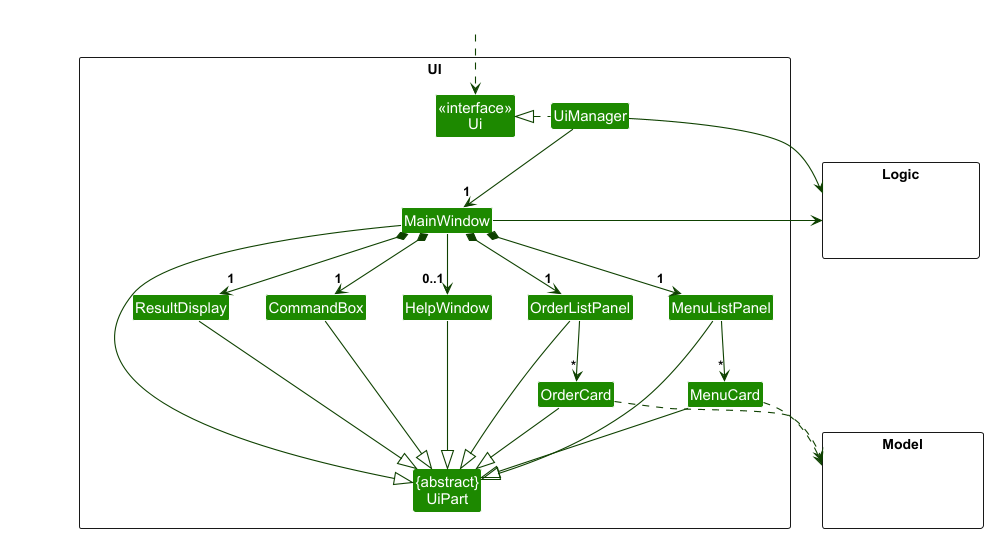
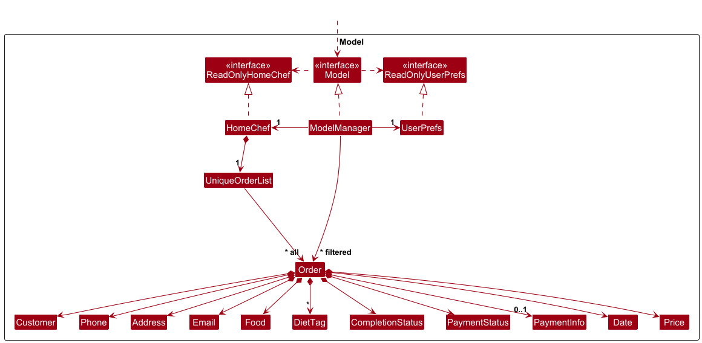
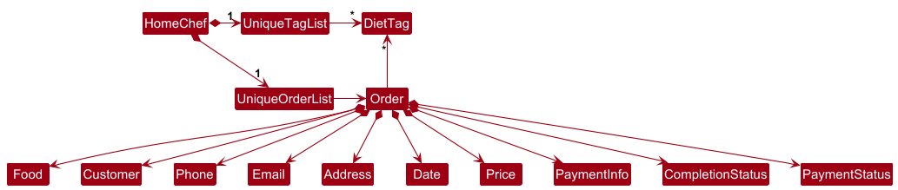
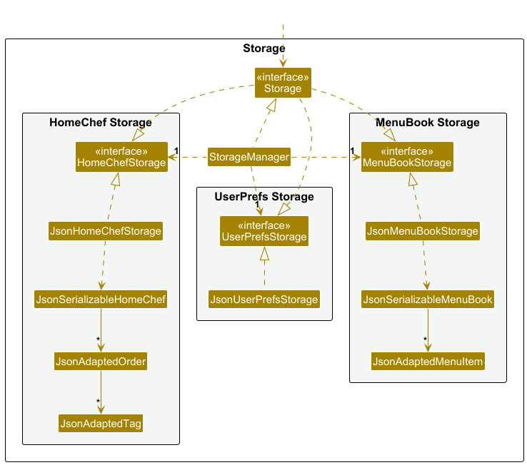

* Table of Contents
{:toc}

--------------------------------------------------------------------------------------------------------------------

## **Acknowledgements**

* {list here sources of all reused/adapted ideas, code, documentation, and third-party libraries -- include links to the original source as well}

--------------------------------------------------------------------------------------------------------------------

## **Setting up, getting started**

Refer to the guide [_Setting up and getting started_](SettingUp.md).

--------------------------------------------------------------------------------------------------------------------

## **Design**

:bulb: **Tip:** The `.puml` files used to create diagrams are in this document `docs/diagrams` folder. Refer to the [_PlantUML Tutorial_ at se-edu/guides](https://se-education.org/guides/tutorials/plantUml.html) to learn how to create and edit diagrams.

### Architecture

The ***Architecture Diagram*** given above explains the high-level design of the App.

Given below is a quick overview of main components and how they interact with each other.

**Main components of the architecture**

**`Main`** (consisting of classes [`Main`](https://github.com/AY2526S2-CS2103T-T13-4/tp/blob/master/src/main/java/seedu/homechef/Main.java) and [`MainApp`](https://github.com/AY2526S2-CS2103T-T13-4/tp/blob/master/src/main/java/seedu/homechef/MainApp.java)) is in charge of the app launch and shut down.
* At app launch, it initializes the other components in the correct sequence, and connects them up with each other.
* At shut down, it shuts down the other components and invokes cleanup methods where necessary.

The bulk of the app's work is done by the following four components:

* [**`UI`**](#ui-component): The UI of the App.
* [**`Logic`**](#logic-component): The command executor.
* [**`Model`**](#model-component): Holds the data of the App in memory.
* [**`Storage`**](#storage-component): Reads data from, and writes data to, the hard disk.

[**`Commons`**](#common-classes) represents a collection of classes used by multiple other components.

**How the architecture components interact with each other**

The *Sequence Diagram* below shows how the components interact with each other for the scenario where the user issues the command `delete 1`.

Each of the four main components (also shown in the diagram above),

* defines its *API* in an `interface` with the same name as the Component.
* implements its functionality using a concrete `{Component Name}Manager` class (which follows the corresponding API `interface` mentioned in the previous point).

For example, the `Logic` component defines its API in the `Logic.java` interface and implements its functionality using the `LogicManager.java` class which follows the `Logic` interface. Other components interact with a given component through its interface rather than the concrete class (reason: to prevent outside component's being coupled to the implementation of a component), as illustrated in the (partial) class diagram below.

The sections below give more details of each component.

### UI component

The **API** of this component is specified in [`Ui.java`](https://github.com/AY2526S2-CS2103T-T13-4/tp/blob/master/src/main/java/seedu/homechef/ui/Ui.java)

The UI consists of a `MainWindow` that is made up of parts e.g.`CommandBox`, `ResultDisplay`, `OrderListPanel`, `StatusBarFooter` etc. All these, including the `MainWindow`, inherit from the abstract `UiPart` class which captures the commonalities between classes that represent parts of the visible GUI.

The `UI` component uses the JavaFx UI framework. The layout of these UI parts are defined in matching `.fxml` files that are in the `src/main/resources/view` folder. For example, the layout of the [`MainWindow`](https://github.com/se-edu/addressbook-level3/tree/master/src/main/java/seedu/address/ui/MainWindow.java) is specified in [`MainWindow.fxml`](https://github.com/se-edu/addressbook-level3/tree/master/src/main/resources/view/MainWindow.fxml)

The `UI` component,

* executes user commands using the `Logic` component.
* listens for changes to `Model` data so that the UI can be updated with the modified data.
* keeps a reference to the `Logic` component, because the `UI` relies on the `Logic` to execute commands.
* depends on some classes in the `Model` component, as it displays `Order` object residing in the `Model`.

### Logic component

**API** : [`Logic.java`](https://github.com/AY2526S2-CS2103T-T13-4/tp/blob/master/src/main/java/seedu/homechef/logic/Logic.java)

Here's a (partial) class diagram of the `Logic` component:

The sequence diagram below illustrates the interactions within the `Logic` component, taking `execute("delete 1")` API call as an example.

:information_source: **Note:** The lifeline for `DeleteCommandParser` should end at the destroy marker (X) but due to a limitation of PlantUML, the lifeline continues till the end of diagram.

How the `Logic` component works:

1. When `Logic` is called upon to execute a command, it is passed to an `HomeChefParser` object which in turn creates a parser that matches the command (e.g., `DeleteCommandParser`) and uses it to parse the command.
1. This results in a `Command` object (more precisely, an object of one of its subclasses e.g., `DeleteCommand`) which is executed by the `LogicManager`.
1. The command can communicate with the `Model` when it is executed (e.g. to delete a order). 
   Note that although this is shown as a single step in the diagram above (for simplicity), in the code it can take several interactions (between the command object and the `Model`) to achieve.
1. The result of the command execution is encapsulated as a `CommandResult` object which is returned back from `Logic`.

Here are the other classes in `Logic` (omitted from the class diagram above) that are used for parsing a user command:

How the parsing works:
* When called upon to parse a user command, the `HomeChefParser` class creates an `XYZCommandParser` (`XYZ` is a placeholder for the specific command name e.g., `AddCommandParser`) which uses the other classes shown above to parse the user command and create a `XYZCommand` object (e.g., `AddCommand`) which the `HomeChefParser` returns back as a `Command` object.
* All `XYZCommandParser` classes (e.g., `AddCommandParser`, `DeleteCommandParser`, ...) inherit from the `Parser` interface so that they can be treated similarly where possible e.g, during testing.

### Model component
**API** : [`Model.java`](https://github.com/AY2526S2-CS2103T-T13-4/tp/blob/master/src/main/java/seedu/homechef/model/Model.java)

The `Model` component,

* stores the order list data i.e., all `Order` objects (which are contained in a `UniqueOrderList` object).
* stores the currently 'selected' `Order` objects (e.g., results of a search query) as a separate _filtered_ list which is exposed to outsiders as an unmodifiable `ObservableList<Order>` that can be 'observed' e.g. the UI can be bound to this list so that the UI automatically updates when the data in the list changes.
* stores a `UserPref` object that represents the user’s preferences. This is exposed to the outside as a `ReadOnlyUserPref` objects.
* does not depend on any of the other three components (as the `Model` represents data entities of the domain, they should make sense on their own without depending on other components)

:information_source: **Note:** An alternative (arguably, a more OOP) model is given below. It has a `DietTag` list in the `HomeChef`, which `Order` references. This allows `HomeChef` to only require one `DietTag` object per unique tag, instead of each `Order` needing its own `DietTag` objects. 

### Storage component

**API** : [`Storage.java`](https://github.com/AY2526S2-CS2103T-T13-4/tp/blob/master/src/main/java/seedu/homechef/storage/Storage.java)

The `Storage` component,
* can save order data, menu book data and user preference data in JSON format, and read them back into corresponding objects.
* inherits from `HomeChefStorage`, `MenuBookStorage` and `UserPrefStorage`, which means it can be treated as any one (if only the functionality of one is needed).
* depends on some classes in the `Model` component (because the `Storage` component's job is to save/retrieve objects that belong to the `Model`)

### Common classes

Classes used by multiple components are in the `seedu.homechef.commons` package.

--------------------------------------------------------------------------------------------------------------------

## **Implementation**

This section describes some noteworthy details on how certain features are implemented.

--------------------------------------------------------------------------------------------------------------------

## **Documentation, logging, testing, configuration, dev-ops**

* [Documentation guide](Documentation.md)
* [Testing guide](Testing.md)
* [Logging guide](Logging.md)
* [Configuration guide](Configuration.md)
* [DevOps guide](DevOps.md)

--------------------------------------------------------------------------------------------------------------------

## **Appendix: Requirements**

### Product scope

**Target user profile**:

Home-based online F&B business owners who
* has a need to manage significant number of custom orders
* take custom orders through chat and social media platforms
* need a simple, centralized way to track orders, scheduling, delivery, and payment status.
* is reasonably comfortable using desktop apps

**Value proposition**:
This app helps home-based and online F&B sellers keep customer and order details in one organised place.

It tracks repeat orders, feedback, payment, and delivery status so sellers do not lose messages or mix up orders across chats, improving reliability and customer satisfaction.

It highlights potential scheduling issues to help sellers manage deliveries.

### User stories

Priorities: High (must have) - `* * *`, Medium (nice to have) - `* *`, Low (unlikely to have) - `*`

| Priority | As a …​            | I want to …​                                           | So that I can…​                                                                 |
|----------|--------------------|-------------------------------------------------------|--------------------------------------------------------------------------------|
| `* * *`  | user               | add payment information to orders                    | I know who owes me money                                                      |
| `*`      | user               | add a new person                                     | add a new customer to the system                                              |
| `* * *`  | user               | add a new order linked to an existing customer       | record what they ordered and when it's due                                    |
| `* * *`  | user               | view all orders due for delivery today               | see my workload for the day at a glance                                        |
| `* * *`  | user               | delete a cancelled order from the system             | avoid confusing it with active orders that need to be fulfilled               |
| `* * *`  | user               | add dietary restrictions or special instructions     | remember to make the cake nut-free or sugar-free as requested                 |
| `* * *`  | user               | mark an order as paid / unpaid / partially paid      | track outstanding payments or balances easily                                 |
| `* * *`  | user               | mark order completion status                         | know the state of my current orders                                           |
| `* *`    | user               | edit contact information after the order is complete | modify and update information if records were incorrect                       |
| `* *`    | expert user        | use shortcuts for commands                           | efficiently type out commands                                                 |
| `* *`    | user               | filter orders by customer name or phone number       | quickly find their information without scrolling through the entire list      |
| `* *`    | user               | view schedule of orders ordered by time              | quickly see the total schedule of work                                        |
| `* *`    | professional user  | generate a simple order summary                      | send customers a confirmation of the order details                            |
| `* *`    | new user           | view a user guide                                    | learn how to use the program properly                                         |
| `* *`    | long-time user     | see revenue breakdown by product                     | know which products are most profitable for the business                      |
| `* *`    | user               | use natural language for entering times or dates     | avoid entering precise dates in a strict format                               |
| `*`      | user               | see which order is urgent                            | know which order to prioritise                                                |
| `*`      | user               | mark unavailable dates                               | stop accepting orders that cannot be fulfilled                                |
| `*`      | user               | detect scheduling conflicts                          | avoid overcommitting and missing deliveries                                   |
| `*`      | long-time user     | tag repeat customers                                 | prioritise or cater to their needs differently                                |
| `*`      | user               | export data to a spreadsheet                         | back up data or use it for other purposes                                     |
| `*`      | user               | set limits on orders for a selected day              | avoid accepting too many orders and becoming burnt out                        |

*{More to be added}*

### Use cases

(For all use cases below, the **System** is the `HomeChef Helper` and the **Actor** is the `user`, unless specified otherwise)

**Use case: UC01 - Delete a customer**

**MSS**

1. User requests to list customers.
2. System shows a list of customers.
3. User requests to delete a specific customer in the list.
4. System deletes the customer.

   Use case ends.

**Extensions**

* 2a. The list is empty.

  Use case ends.

* 3a. The given index is invalid.

    * 3a1. System shows an error message.

      Use case resumes at step 2.

**Use case: UC02 - Add an order for an existing customer**

**MSS**

1. User searches for the customer (UC04).
2. User requests to add an order for a specific customer in the results.
3. System requests for order details.
4. User enters the requested details.
5. System saves the order and displays the updated order list.

   Use case ends.

**Extensions**

* 2a. The given index is invalid.

    * 2a1. System shows an error message.

      Use case resumes at step 1.

* 4a. System detects an error in the entered data.

    * 4a1. System shows an error message and requests correct data.
    * 4a2. User enters new data.

      Steps 4a1-4a2 are repeated until the data entered is correct.

      Use case resumes from step 5.

**Use case: UC03 - Mark an order as paid**

**MSS**

1. User requests to list orders.
2. System shows a list of orders.
3. User requests to mark a specific order as paid.
4. System updates the payment status and displays the updated order.

   Use case ends.

**Extensions**

* 2a. The list is empty.

  Use case ends.

* 3a. The given index is invalid.

    * 3a1. System shows an error message.

      Use case resumes at step 2.

* 3b. The order is already marked as paid.

    * 3b1. System shows a message indicating the order is already paid.

      Use case ends.

**Use case: UC04 - Search for a customer by name**

**MSS**

1. User requests to filter orders by customer name.
2. System shows a list of customers matching the search term.

   Use case ends.

**Extensions**

* 2a. No customers match the search term.

    * 2a1. System shows a message indicating no results found.

      Use case ends.

**Use case: UC05 - Update order completion status**

**MSS**

1. User requests to list orders.
2. System shows a list of orders.
3. User requests to update the status of a specific order (e.g., pending → in progress → delivered).
4. System updates the status and displays the updated order.

   Use case ends.

**Extensions**

* 2a. The list is empty.

  Use case ends.

* 3a. The given index is invalid.

    * 3a1. System shows an error message.

      Use case resumes at step 2.

* 3b. The given status value is invalid.

    * 3b1. System shows an error message with valid status options.

      Use case resumes at step 3.

*{More to be added}*

### Non-Functional Requirements

1.  Should work on any _mainstream OS_ as long as it has Java `17` or above installed.
2.  Should be able to hold up to 1000 orders without a noticeable sluggishness in performance for typical usage.
3.  A user with above average typing speed for regular English text (i.e. not code, not system admin commands) should be able to accomplish most of the tasks faster using commands than using the mouse.
4.  All data should be stored locally and persisted automatically, so that customer and order information remains available after restarting the application.
5.  The application should not require an internet connection for normal operation.
6.  The system should respond to any user command within 2 seconds under normal operating conditions.
7.  The total size of the application (JAR file) should not exceed 100MB to ensure easy distribution and download.
8.  The data file format should be human-readable (e.g. JSON) so that data can be manually inspected or recovered if necessary.
9.  The application should be usable by a new user with no prior training, allowing them to complete core tasks within 10 minutes of first launch using only the built-in help command.

*{More to be added}*

### Glossary

* **Mainstream OS**: Windows, Linux, Unix, macOS.
* **Order**: A record of a request for food, linked to exactly one Customer.
* **Customer**: A person who placed an order.
* **Dietary Restrictions**: Constraints on ingredients and preparation for an order.
* **Shortcut**: An alternative, faster way to execute a command using fewer characters.
* **Payment Status**: Whether an order has been paid for. Possible states are: Paid, Unpaid, Partially Paid.
* **Completion Status**: Whether an order has been finished and delivered. Possible states are: Pending, In Progress, Completed.
* **Menu**: A set of food items which a Customer can select and make a purchase from.

--------------------------------------------------------------------------------------------------------------------

## **Appendix: Instructions for manual testing**

Given below are instructions to test the app manually.

:information_source: **Note:** These instructions only provide a starting point for testers to work on;
testers are expected to do more *exploratory* testing.

### Launch and shutdown

1. Initial launch

   1. Download the jar file and copy into an empty folder

   1. Double-click the jar file Expected: Shows the GUI with a set of sample contacts. The window size may not be optimum.
      1. If this doesn't work, use your OS's command terminal, navigate to the folder containing `homechef.jar` using `cd` and execute `java -jar homechef.jar` in the terminal.

1. Saving window preferences

   1. Resize the window to an optimum size. Move the window to a different location. Close the window.

   1. Re-launch the app by double-clicking the jar file. 
       Expected: The most recent window size and location is retained.

1. Closing the app

    1. Prerequisites: Have the HomeChef Helper app open.

    1. Test case: Type `exit` into the command bar.  Expected: App closes with minimal delay.

    1. Test case: Type `exit 1`, `exit x`, `...` into the command bar, where x is any combination of alphanumeric characters. 
       Expected: App closes with minimal delay. No error details should be shown.

    1. Test case: Type `command exit`, `x exit`, `...` into the command bar, where x is any combination of alphanumeric characters that **do not match** an existing command. 
       Expected: App remains open. Unknown command error message is shown.

    1. Test case: Type `add exit`, `delete exit`, `x exit`, `...` into the command bar, where x is any combination of alphanumeric characters that **matches** an existing command. 
       Expected: App remains open. Invalid command format error message is shown.

    1. Test case: Click the close icon on the top right of the window.  Expected: App closes with minimal delay.

### Deleting an order

1. Deleting an order while all orders are being shown

   1. Prerequisites: List all orders using the `list` command. Multiple orders in the list.

   1. Test case: `delete 1` 
      Expected: First order is deleted from the list. Details of the deleted order shown in the status message. Timestamp in the status bar is updated.

   1. Test case: `delete 0` 
      Expected: No order is deleted. Error details shown in the status message. Status bar remains the same.

   1. Other incorrect delete commands to try: `delete`, `delete x`, `...` (where x is larger than the list size) 
      Expected: Similar to previous.

1. Deleting an order from an order list filtered by food name

    1. Prerequisites: Have multiple orders with a common character or word in the food name such as "cake". List all orders using the `list f/FOOD` command. `FOOD` refers to the common food name the orders have.

    1. Test case: `delete 2` 
       Expected: First order is deleted from the filtered list. Details of the deleted order shown in the status message. Timestamp in the status bar is updated. Switching back to the original unfiltered list using `list` should also show that the order of the same information is deleted, though it may not be of the same index as in the filtered list.

    1. Test case: `delete 0` 
       Expected: No order is deleted. Error details shown in the status message. Status bar remains the same.

    1. Other incorrect delete commands to try: `delete`, `delete x`, `...` (where x is larger than the list size) 
       Expected: Similar to previous.

### Saving data

1. Dealing with missing/corrupted data files

   1. _{explain how to simulate a missing/corrupted file, and the expected behavior}_

1. _{ more test cases …​ }_
