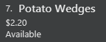
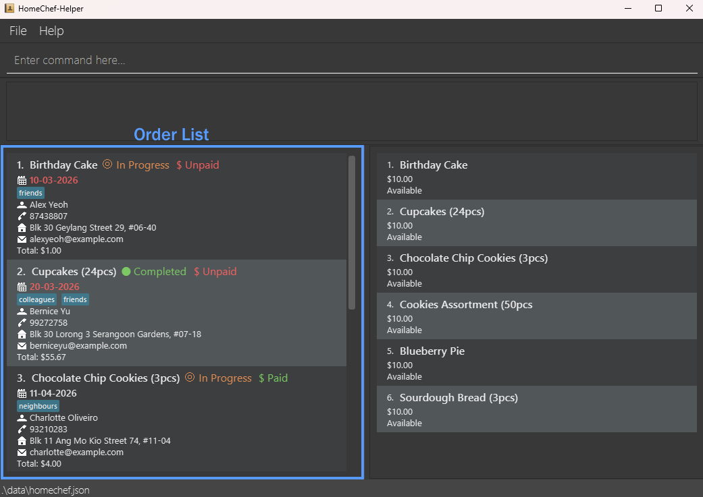
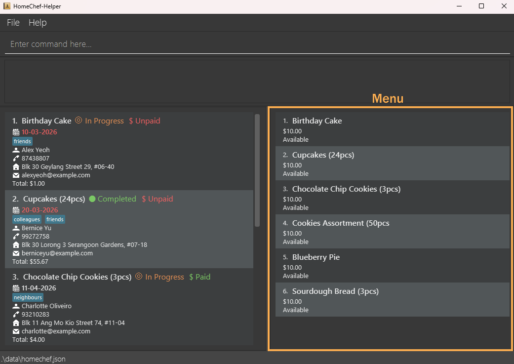

HomeChef-Helper (HomeChef) is a **desktop app for managing orders, optimized for use via a Command Line Interface** (CLI) while still having the benefits of a Graphical User Interface (GUI). If you can type fast, HomeChef can get your order management tasks done faster than traditional GUI apps.

* Table of Contents
{:toc}

--------------------------------------------------------------------------------------------------------------------

# Looking to get started?
## Here's a quick guide:

1. Ensure you have Java `17` or above installed in your Computer. 
    A tutorial on how to download Java `17` can be found [here](https://se-education.org/guides/tutorials/javaInstallation.html). 
   **Mac users:** Ensure you have the precise JDK version prescribed [here](https://se-education.org/guides/tutorials/javaInstallationMac.html).

1. Download the latest `.jar` file from [here](https://github.com/AY2526S2-CS2103T-T13-4/tp/releases). Only the `.jar` file is needed, not the source code.

1. Copy the file to the folder you want to use as the _home folder_ for your HomeChef.

1. Double-click on the `homechef.jar` file to launch the app. 
   If that does not work, try the following:
   > 1. Open a command terminal.  (Command Prompt or Powershell on Windows, Terminal on Mac) 
   > 1. Use the `cd` command to navigate into the folder you put the jar file in.  For example:  `cd Desktop/Folder1/FolderContainingHomeChef` 
   > 1. Type the `java -jar homechef.jar` command to run the application. 
      
    If successful, a screen similar to the one below should appear in a few seconds. The app contains some sample data for you to get an idea of how the it functions. 

    

1. Type the command in the command box and press Enter to execute it. e.g. typing **`help`** and pressing Enter will open the help window. 
   Some example commands you can try:

   * `list` : Lists all orders. Good for resetting the display to show a full view of all orders you have.
   
   * `list f/cake` : Lists all orders with "cake" in the food's name. Good for finding orders of a similar type, or sharing the same customer.

   * `add f/Red Bean Bun c/John Doe p/1234 e/johnd@example.com a/John street, block 123, #01-01 d/30-03-2026 $/1.20` : 
   Adds an order named `Red Bean Bun` with customer name `John Doe` to HomeChef.  
   The newly added order should look like this: 
    
   Note that the ID number may defer if there are other orders in the list. 
   The date may also be of a different colour (red or orange) if the current date is after 30-03-2026.

   * `complete 1` : Marks the 1st order shown in the current list as completed. Helps to show what orders you have done at a glance!
   
   * `delete 3` : Deletes the 3rd order shown in the current list. Perfect for removing long completed orders that you won't refer to anymore.

   * `add-menu n/Potato Wedges x/2.20` : Adds a food item called `Potato Wedges` with a price of `$2.20` into the menu on the right. 
   The newly added menu item should look like this: 
    

   * `exit` : Exits the app. See you next time!

1. Do refer to the [Features](#features) below for details of each command.

--------------------------------------------------------------------------------------------------------------------

# Features

**:information_source: Notes about the command format:** 

* Words in `UPPER_CASE` are the parameters to be supplied by the user. 
  e.g. in `add f/FOOD`, `FOOD` is a parameter which can be used as `add f/Chocolate Cake`.

* Items in square brackets are optional. 
  e.g `f/FOOD [t/TAG]` can be used as `f/Butter Cake t/no dairy` or as `n/no dairy`.

* Items with `…`​ after them can be used multiple times including zero times. 
  e.g. `[t/TAG]…​` can be used as ` ` (i.e. 0 times), `t/no peanuts`, `t/gluten-free t/extra sprinkles` etc.

* Parameters can be in any order. 
  e.g. if the command specifies `f/FOOD p/PHONE`, `p/PHONE f/FOOD` is also acceptable.

* Extra parameters for commands that do not take in parameters (such as `help`, `exit` and `clear`) will be ignored. 
  e.g. if the command specifies `help 123`, it will be interpreted as `help`.

* If you are using a PDF version of this document, be careful when copying and pasting commands that span multiple lines as space characters surrounding line-breaks may be omitted when copied over to the application.

## Order List commands:

The order list is the list on the left, showing all the orders made by customers for certain food items.

The following are the commands that interact with this order list.

### Adding an order: `add`

Adds an order to the order list.
All orders are initially set as 'Pending' and 'Unpaid'.

Format: `edit INDEX f/FOOD c/NAME p/PHONE e/EMAIL a/ADDRESS d/DATE $/PRICE [t/TAG]…​ 
[m/PAYMENT METHOD] [r/PAYMENT REF] [b/BANK NAME] [w/WALLET PROVIDER]`

* `PRICE` is a non-negative number up to 2 decimal places. Any more decimals will cause an error message to appear.

:bulb: **Tip:**
An order can have any number of dietTags (including 0)

Orders have their price set to dollars `$`. Other currencies are not supported.
Orders have their dates coloured according to the urgency of the Order.
> White indicates that the `Order` is not late, it is due ***more than 3 days*** from today's date. 
>  
> Orange indicates that the `Order` is not late, but it is ***due within 3 days*** of today's date. 
>  
> Red indicates that the `Order` is late, it was due ***before*** today's date. 
> 

Examples:
* `add f/Red Bean Bun c/John Doe p/98765432 e/johnd@example.com a/John street, block 123, #01-01 d/30-03-2026 $/1.20`
* `add f/Hawaiian Pizza c/Betsy Crowe t/Halal e/betsycrowe@example.com a/Newgate Prison p/1234567 d/12-12-2026 $/18.80 t/No peanuts`
* `add f/Bananas c/Monkey p/80801414 t/An actual monkey e/ooaa@ananab.com a/Monkey Village m/Bank r/123456789 b/Monkey Bank d/18-03-2026 $/6.70`

### Listing all orders : `list`

Shows a list of all orders in the order list when no parameters are given, 
Otherwise, shows a filtered list of orders that match the keywords given as parameters.

Format: `list [d/DATE] [c/CUSTOMER] [f/FOOD] [p/PHONE] [cs/COMPLETION STATUS] [ps/PAYMENT STATUS]`

* Lists all orders when no parameters are given.
* Filters are case-insensitive for `c/`, `f/` and `p/`.
* `DATE` must be in the format `dd-MM-yyyy`.
* `COMPLETION_STATUS` must be one of `Pending`, `In progress` or `Completed`.
* `PAYMENT_STATUS` must be one of `Paid`, `Unpaid` or `Partial`.

Examples:
* `list`
* `list d/18-10-2026`
* `list p/1234`
* `list d/16-04-2003 c/alice f/cake p/1234`
* `list cs/Completed ps/Paid`

### Marking an order as in progress: `in progress`

Sets the completion status of an order to 'In progress'.
In progress orders have their completion status coloured orange.

Format: `inprogress INDEX`

### Marking an order as complete: `complete`

Sets the completion status of an order to 'Completed'.
Completed orders have their completion status coloured green.

Format: `complete INDEX`

### Marking an order as pending: `pending`

Sets the completion status of an order to 'Pending'.
Pending orders have their completion status coloured dark grey.

Format: `pending INDEX`

### Marking an order as paid: `paid`

Sets the payment status of an order to '$ Paid'.
Paid orders have their payment status coloured green.

Format: `paid INDEX`

### Marking an order as partially paid: `partial`

Sets the payment status of an order to '$ Partial'.
Partially paid orders have their payment status coloured yellow.

Format: `partial INDEX`

### Marking an order as unpaid: `unpaid`

Sets the payment status of an order to '$ Unpaid'.
Unpaid orders have their payment status coloured red.

Format: `unpaid INDEX`

### Generating a receipt: `receipt`

Generates a plain-text receipt file for the specified order.

Format: `receipt INDEX`

* The index refers to the index number shown in the displayed order list.
* A receipt file is created in a `receipts` folder beside the HomeChef data file.
* You can also use the shortcut command `rec`.

Examples:
* `receipt 1`
* `rec 2`

### Editing an order : `edit`

Edits an existing order in the order list.

Format: 
`edit INDEX [f/FOOD] [c/NAME] [p/PHONE] [e/EMAIL] [a/ADDRESS] [d/DATE] [$/PRICE] [t/TAG]…​
[m/PAYMENT METHOD] [r/PAYMENT REF] [b/BANK NAME] [w/WALLET PROVIDER]`

* Edits the order at the specified `INDEX`. The index refers to the index number shown in the displayed order list. The index **must be a positive integer** 1, 2, 3, …​
* At least one of the optional fields must be provided.
* Existing values will be updated to the input values.
* When editing dietTags, the existing dietTags of the order will be removed i.e adding of dietTags is not cumulative.
* You can remove all the order’s dietTags by typing `t/` without
    specifying any dietTags after it.

Examples:
*  `edit 1 p/91234567 e/johndoe@example.com` Edits the phone number and email address of the 1st order to be `91234567` and `johndoe@example.com` respectively.
*  `edit 2 c/Betsy Crower t/` Edits the name of the 2nd order's customer to be `Betsy Crower` and clears all existing dietTags.

### Locating orders by customer name: `find`

Finds orders whose customer names contain any of the given keywords.

Format: `find KEYWORD [MORE_KEYWORDS]`

* The search is case-insensitive. e.g `hans` will match `Hans`
* The order of the keywords does not matter. e.g. `Hans Bo` will match `Bo Hans`
* Only the name is searched.
* Only full words will be matched e.g. `Han` will not match `Hans`
* Orders matching at least one keyword will be returned (i.e. `OR` search).
  e.g. `Hans Bo` will return `Hans Gruber`, `Bo Yang`

Examples:
* `find John` returns `john` and `John Doe`
* `find alex david` returns `Alex Yeoh`, `David Li` 
  

### Deleting an order : `delete`

Deletes the specified order.

Format: `delete INDEX`

* Deletes the order at the specified `INDEX`.
* The index refers to the index number shown in the displayed order list.
* The index **must be a positive integer** 1, 2, 3, …​

Examples:
* `list` followed by `delete 2` deletes the 2nd order in the current list.
* `find Betsy` followed by `delete 1` deletes the 1st order in the results of the `find` command.

### Clearing all entries : `clear`

:exclamation: **Caution:**
This action **cannot be reversed** so only do this if you are sure you want to delete **every** order in the list.   If not, use the delete command instead.

Clears all entries from the order list.

Format: `clear`

## Menu commands:

The menu is the list on the right, indicating the food items you have for sale.

The following are the commands that interact with this menu.

### Adding a food item : `add-menu`

Adds a food item of the given name, price and availability to the menu.

Format: `add-menu n/NAME x/PRICE [v/AVAILABILITY]`

* Similar functionality to that of `add` for the order list, except the fields have different prefixes.
* `AVAILABILITY` is a boolean that only accepts `true` or `false` spelled exactly.
* If not specified, `AVAILABILITY` is set as `Available` by default.

Examples:
* `add-menu n/Bee Hoon x/5` will add a food item called `Bee Hoon` into the menu with a price of `$5` and is specified as `Available`.
* `add-menu n/Mee Goreng x/6.00 v/false` will add a food item called `Mee Goreng` into the menu with a price of `$6.00` and is specified is `Unavailable`.

### Deleting a food item : `delete-menu`

Deletes the food item identified by the index number used in the displayed menu list.

Format: `delete-menu INDEX`

### Editing a food item : `edit-menu`

Edits an existing food item in the menu.

Format: `edit-menu INDEX [n/NAME] [x/PRICE] [v/AVAILABILITY]`

* Similar functionality to that of `edit` for the order list, except the fields have different prefixes.
* `AVAILABILITY` is a boolean that only accepts `true` or `false` spelled exactly.

Example:
* `edit-menu 1 n/Raisin Cookies x/2.00` edits the food in the first position of the displayed menu to have the name `Raisin Cookies` and a price of `$2.00`.
* `edit-menu 2 n/Pain au Chocolat x/3.50 v/false` edits the food in the second position of the displayed menu to have the name `Pain au Chocolat` and a price of `$3.50`. 

## Other commands:

### Viewing help : `help`

Shows a message explaining how to access the help page.

Format: `help`

### Exiting the program : `exit`

Exits the program.

Format: `exit`

* You can also exit the program by using your mouse cursor and clicking on the dropdown tab labelled `File` and then clicking on `Exit`. 

### Saving the data

HomeChef data is saved in the hard disk automatically after any command that changes the data. There is no need to save manually.  

:bulb: **Tip:** 
It is, however, recommended that a backup of the homechef.json and menu.json files are made by copying them to a seperate folder outside of the Homechef folder. This will allow you to copy the files back to the `data` folder as and when is needed, such as when a `clear` command is accidentally executed.

### Editing the data file

HomeChef data is saved automatically as a JSON file `[JAR file location]/data/homechef.json`. Advanced users are welcome to update data directly by editing that data file.

:exclamation: **Caution:**
If your changes to the data file makes its format invalid, HomeChef will **discard all data** and start with an empty data file at the next run. Hence, it is recommended to take a backup of the file before editing it. 
Furthermore, certain edits can cause the HomeChef to behave in unexpected ways (e.g., if a value entered is outside of the acceptable range). Therefore, edit the data file only if you are confident that you can update it correctly.

--------------------------------------------------------------------------------------------------------------------

## FAQ

**Q**: How do I transfer my data to another Computer? 
**A**: Download the app in the other computer and set it up as mentioned in the Quick Guide section above. 
Overwrite the empty data file it creates with the file that contains the data of your previous HomeChef home folder (the `homechef.json` and `menu.json` files).

**Q**: Help! The order list and menu are blank, has my data **all** been deleted? 
**A**: Unfortunately, **yes**. There is no way to recover the data unless a **backup copy** was made of the `homechef.json` and `menu.json` files. 
If the copies exist, copy them over to the `data` folder located in the folder that contains the jar file you downloaded.

--------------------------------------------------------------------------------------------------------------------

## Known issues

1. **When using multiple screens**, if you move the application to a secondary screen, and later switch to using only the primary screen, the GUI will open off-screen. The remedy is to delete the `preferences.json` file created by the application before running the application again.
2. **If you minimize the Help Window** and then run the `help` command (or use the `Help` menu, or the keyboard shortcut `F1`) again, the original Help Window will remain minimized, and no new Help Window will appear. The remedy is to manually restore the minimized Help Window.

--------------------------------------------------------------------------------------------------------------------

## Command summary

Action | Format, Examples
--------|------------------
**Add** | `add f/FOOD c/NAME p/PHONE_NUMBER e/EMAIL a/ADDRESS $/PRICE [t/TAG]…​ [m/PAYMENT METHOD] [r/PAYMENT REF] [b/BANK NAME] [w/WALLET PROVIDER]`   e.g., `add n/James Ho p/22224444 e/jamesho@example.com a/123, Clementi Rd, 1234665 t/friend t/colleague`
**List** | `list [d/DATE] [c/CUSTOMER] [f/FOOD] [p/PHONE] [cs/COMPLETION_STATUS] [ps/PAYMENT_STATUS]`  e.g., `list d/18-10-2026 cs/completed ps/Paid`
**Mark In Progress** | `inprogress INDEX`   e.g., `inprogress 2`
**Mark Complete** | `complete INDEX`   e.g., `complete 4`
**Mark Pending** | `pending INDEX`   e.g., `pending 3`
**Mark Paid** | `paid INDEX`   e.g., `paid 1`
**Mark Partial** | `partial INDEX`   e.g., `partial 1`
**Mark Unpaid** | `unpaid INDEX`   e.g., `unpaid 1`
**Edit** | `edit INDEX [f/FOOD] [n/NAME] [p/PHONE_NUMBER] [e/EMAIL] [a/ADDRESS] [t/TAG]…​ [m/PAYMENT METHOD] [r/PAYMENT REF] [b/BANK NAME] [w/WALLET PROVIDER]`  e.g.,`edit 2 n/James Lee e/jameslee@example.com`
**Find** | `find KEYWORD [MORE_KEYWORDS]`  e.g., `find James Jake`
**Delete** | `delete INDEX`  e.g., `delete 3`
**Clear** | `clear`
**Add Menu** | `add-menu n/NAME x/PRICE [v/AVAILABILITY]`   e.g., `add-menu n/Bee Hoon x/5.00 v/true`
**Delete Menu** | `delete-menu INDEX`  e.g., `delete 3`
**Edit Menu** | `edit-menu INDEX n/NAME x/PRICE [v/AVAILABILITY]`   e.g., `edit-menu 2 n/Pain au Chocolat x/3.50 v/true`
**Help** | `help`
**Exit** | `exit`
