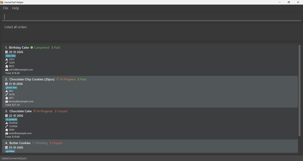
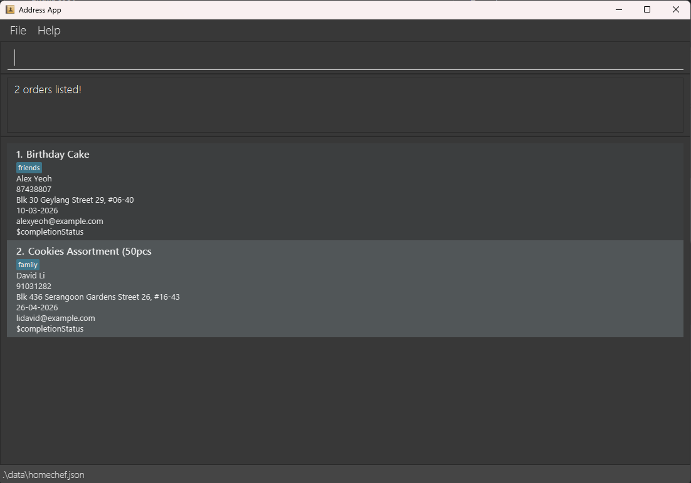

HomeChef-Helper (HomeChef) is a **desktop app for managing orders, optimized for use via a Command Line Interface** (CLI) while still having the benefits of a Graphical User Interface (GUI). If you can type fast, HomeChef can get your order management tasks done faster than traditional GUI apps.

* Table of Contents
{:toc}

--------------------------------------------------------------------------------------------------------------------

## Quick start

1. Ensure you have Java `17` or above installed in your Computer. 
    A tutorial on how to download Java `17` can be found [here](https://se-education.org/guides/tutorials/javaInstallation.html). 
   **Mac users:** Ensure you have the precise JDK version prescribed [here](https://se-education.org/guides/tutorials/javaInstallationMac.html).

1. Download the latest `.jar` file from [here](https://github.com/AY2526S2-CS2103T-T13-4/tp/releases).

1. Copy the file to the folder you want to use as the _home folder_ for your HomeChef.

1. Double click on the `homechef.jar` file to launch the app. 
   If that does not work, try the following:
   > 1. Open a command terminal, (Command Prompt or Powershell on Windows, Terminal on Mac). 
   > 1. `cd` into the folder you put the jar file in.  For example:  `cd Desktop/Folder1/FolderContainingHomeChef` 
   > 1. Type the `java -jar homechef.jar` command to run the application. 
      
    If successful, a screen similar to the below should appear in a few seconds. Note how the app contains some sample data. 
      

1. Type the command in the command box and press Enter to execute it. e.g. typing **`help`** and pressing Enter will open the help window. 
   Some example commands you can try:

   * `list` : Lists all orders.

   * `add f/Red Bean Bun c/John Doe p/98765432 e/johnd@example.com a/John street, block 123, #01-01 d/30-03-2026` : Adds a order named `John Doe` to HomeChef.

   * `delete 3` : Deletes the 3rd order shown in the current list.

   * `clear` : Deletes all orders.

   * `exit` : Exits the app.

1. Refer to the [Features](#features) below for details of each command.

--------------------------------------------------------------------------------------------------------------------

## Features

**:information_source: Notes about the command format:** 

* Words in `UPPER_CASE` are the parameters to be supplied by the user. 
  e.g. in `add n/NAME`, `NAME` is a parameter which can be used as `add n/John Doe`.

* Items in square brackets are optional. 
  e.g `n/NAME [t/TAG]` can be used as `n/John Doe t/friend` or as `n/John Doe`.

* Items with `…`​ after them can be used multiple times including zero times. 
  e.g. `[t/TAG]…​` can be used as ` ` (i.e. 0 times), `t/friend`, `t/friend t/family` etc.

* Parameters can be in any order. 
  e.g. if the command specifies `n/NAME p/PHONE_NUMBER`, `p/PHONE_NUMBER n/NAME` is also acceptable.

* Extraneous parameters for commands that do not take in parameters (such as `help`, `exit` and `clear`) will be ignored. 
  e.g. if the command specifies `help 123`, it will be interpreted as `help`.

* If you are using a PDF version of this document, be careful when copying and pasting commands that span multiple lines as space characters surrounding line-breaks may be omitted when copied over to the application.

### Viewing help : `help`

Shows a message explaining how to access the help page.

Format: `help`

### Adding an order: `add`

Adds an order to the order list.
All orders are initially set as 'Pending' and 'Unpaid'.

Format: `edit INDEX f/FOOD c/NAME p/PHONE e/EMAIL a/ADDRESS d/DATE [t/TAG]…​ 
[m/PAYMENT METHOD] [r/PAYMENT REF] [b/BANK NAME] [w/WALLET PROVIDER]`

:bulb: **Tip:**
An order can have any number of dietTags (including 0)

Orders have their dates coloured according to the urgency of the Order.
> White indicates that the `Order` is not late, it is due ***more than 3 days*** from today's date. 
> Orange indicates that the `Order` is not late, but it is ***due within 3 days***. 
> Red indicates that the `Order` is late, it was due ***before*** today's date.

Examples:
* `add f/Red Bean Bun c/John Doe p/98765432 e/johnd@example.com a/John street, block 123, #01-01 d/30-03-2026`
* `add f/Hawaiian Pizza c/Betsy Crowe t/Halal e/betsycrowe@example.com a/Newgate Prison p/1234567 d/12-12-2026 t/No peanuts`
* `add f/Bananas c/Monkey p/80801414 t/An actual monkey e/ooaa@ananab.com a/Monkey Village m/Bank r/123456789 b/Monkey Bank d/18-03-2026`

### Listing all orders : `list`

Shows a list of all orders in the order list.

Format: `list [d/DATE] [c/CUSTOMER] [f/FOOD] [p/PHONE]`

* Lists all orders when no parameters are given.
* Filters are case-insensitive for `c/`, `f/` and `p/`.
* `DATE` must be in the format `dd-MM-yyyy`.

Examples:
* `list`
* `list d/18-10-2026`
* `list c/alice`
* `list f/cake`
* `list p/1234`
* `list d/16-04-2003 c/alice f/cake p/1234`

### Marking an order as in progress: `inprogress`

Sets the completion status of an order to 'In progress'.
In progress orders have their completion status coloured orange.

Format: `inprogress INDEX`

### Marking an order as complete: `complete`

Sets the completion status of an order to 'Completed'.
Completed orders have their completion status coloured green.

Format: `complete INDEX`

### Marking an order as pending: `pending`

Sets the completion status of an order to 'Pending'.
Pending orders have their completion status coloured dark grey.

Format: `pending INDEX`

### Marking an order as paid: `paid`

Sets the payment status of an order to '$ Paid'.
Paid orders have their payment status coloured green.

Format: `paid INDEX`

### Marking an order as unpaid: `unpaid`

Sets the payment status of an order to '$ Unpaid'.
Unpaid orders have their payment status coloured red.

Format: `unpaid INDEX`

### Editing an order : `edit`

Edits an existing order in the order list.

Format: 
`edit INDEX [f/FOOD] [c/NAME] [p/PHONE] [e/EMAIL] [a/ADDRESS] [d/DATE] [t/TAG]…​ 
[m/PAYMENT METHOD] [r/PAYMENT REF] [b/BANK NAME] [w/WALLET PROVIDER]`

* Edits the order at the specified `INDEX`. The index refers to the index number shown in the displayed order list. The index **must be a positive integer** 1, 2, 3, …​
* At least one of the optional fields must be provided.
* Existing values will be updated to the input values.
* When editing dietTags, the existing dietTags of the order will be removed i.e adding of dietTags is not cumulative.
* You can remove all the order’s dietTags by typing `t/` without
    specifying any dietTags after it.

Examples:
*  `edit 1 p/91234567 e/johndoe@example.com` Edits the phone number and email address of the 1st order to be `91234567` and `johndoe@example.com` respectively.
*  `edit 2 c/Betsy Crower t/` Edits the name of the 2nd order's customer to be `Betsy Crower` and clears all existing dietTags.

### Locating orders by name: `find`

Finds orders whose customer names contain any of the given keywords.

Format: `find KEYWORD [MORE_KEYWORDS]`

* The search is case-insensitive. e.g `hans` will match `Hans`
* The order of the keywords does not matter. e.g. `Hans Bo` will match `Bo Hans`
* Only the name is searched.
* Only full words will be matched e.g. `Han` will not match `Hans`
* Orders matching at least one keyword will be returned (i.e. `OR` search).
  e.g. `Hans Bo` will return `Hans Gruber`, `Bo Yang`

Examples:
* `find John` returns `john` and `John Doe`
* `find alex david` returns `Alex Yeoh`, `David Li` 
  

### Deleting an order : `delete`

Deletes the specified order.

Format: `delete INDEX`

* Deletes the order at the specified `INDEX`.
* The index refers to the index number shown in the displayed order list.
* The index **must be a positive integer** 1, 2, 3, …​

Examples:
* `list` followed by `delete 2` deletes the 2nd order in the current list.
* `find Betsy` followed by `delete 1` deletes the 1st order in the results of the `find` command.

### Clearing all entries : `clear`

Clears all entries from the order list.

Format: `clear`

### Exiting the program : `exit`

Exits the program.

Format: `exit`

### Saving the data

HomeChef data is saved in the hard disk automatically after any command that changes the data. There is no need to save manually.

### Editing the data file

HomeChef data is saved automatically as a JSON file `[JAR file location]/data/homechef.json`. Advanced users are welcome to update data directly by editing that data file.

:exclamation: **Caution:**
If your changes to the data file makes its format invalid, HomeChef will discard all data and start with an empty data file at the next run. Hence, it is recommended to take a backup of the file before editing it. 
Furthermore, certain edits can cause the HomeChef to behave in unexpected ways (e.g., if a value entered is outside of the acceptable range). Therefore, edit the data file only if you are confident that you can update it correctly.

### Archiving data files `[coming in v2.0]`

_Details coming soon ..._

--------------------------------------------------------------------------------------------------------------------

## FAQ

**Q**: How do I transfer my data to another Computer? 
**A**: Install the app in the other computer and overwrite the empty data file it creates with the file that contains the data of your previous HomeChef home folder.

--------------------------------------------------------------------------------------------------------------------

## Known issues

1. **When using multiple screens**, if you move the application to a secondary screen, and later switch to using only the primary screen, the GUI will open off-screen. The remedy is to delete the `preferences.json` file created by the application before running the application again.
2. **If you minimize the Help Window** and then run the `help` command (or use the `Help` menu, or the keyboard shortcut `F1`) again, the original Help Window will remain minimized, and no new Help Window will appear. The remedy is to manually restore the minimized Help Window.

--------------------------------------------------------------------------------------------------------------------

## Command summary

Action | Format, Examples
--------|------------------
**Add** | `add f/FOOD c/NAME p/PHONE_NUMBER e/EMAIL a/ADDRESS [t/TAG]…​ [m/PAYMENT METHOD] [r/PAYMENT REF] [b/BANK NAME] [w/WALLET PROVIDER]`   e.g., `add n/James Ho p/22224444 e/jamesho@example.com a/123, Clementi Rd, 1234665 t/friend t/colleague`
**Clear** | `clear`
**Delete** | `delete INDEX`  e.g., `delete 3`
**Mark Complete** | `complete INDEX`   e.g., `complete 4`
**Mark In Progress** | `in_progress INDEX`   e.g., `in_progress 2`
**Paid** | `paid INDEX`   e.g., `paid 1`
**Unpaid** | `unpaid INDEX`   e.g., `unpaid 1`
**Edit** | `edit INDEX [f/FOOD] [n/NAME] [p/PHONE_NUMBER] [e/EMAIL] [a/ADDRESS] [t/TAG]…​ [m/PAYMENT METHOD] [r/PAYMENT REF] [b/BANK NAME] [w/WALLET PROVIDER]`  e.g.,`edit 2 n/James Lee e/jameslee@example.com`
**Find** | `find KEYWORD [MORE_KEYWORDS]`  e.g., `find James Jake`
**List** | `list [d/DATE] [c/CUSTOMER] [f/FOOD] [p/PHONE]`  e.g., `list d/18-10-2026`
**Help** | `help`
